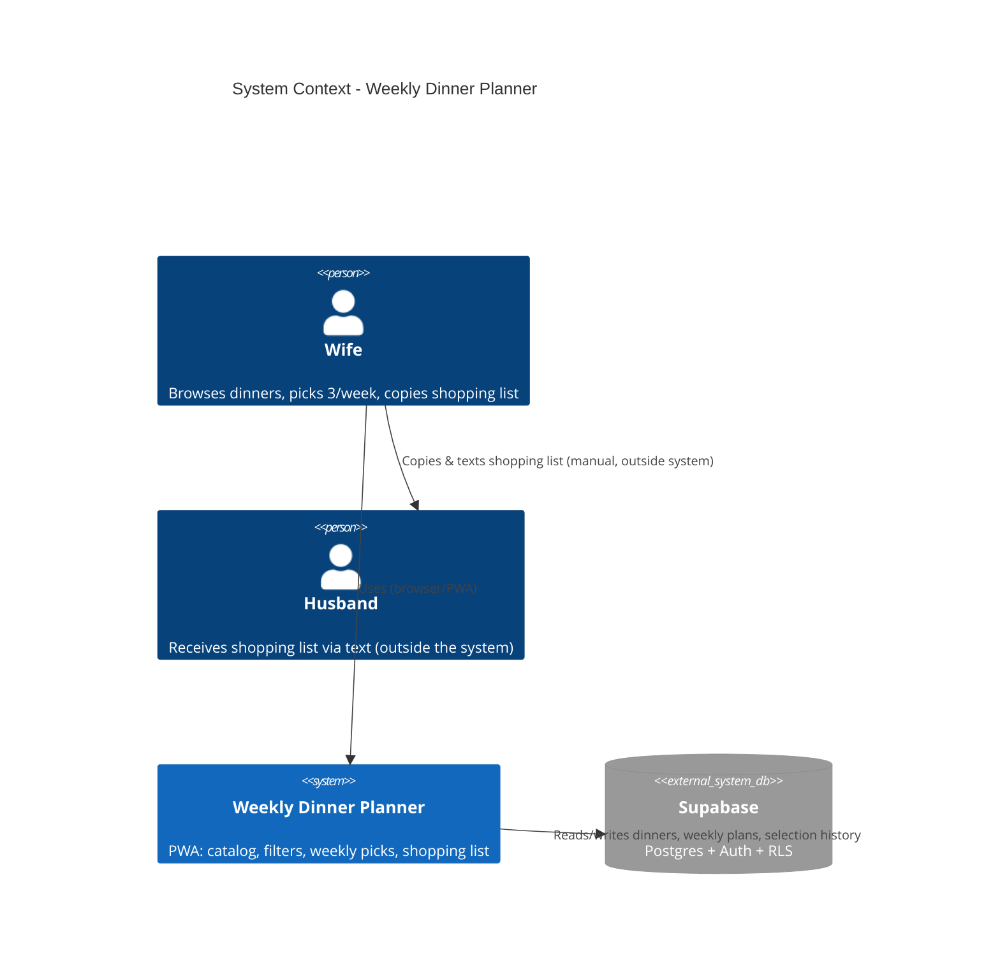

# Weekly Dinner Planner - System Context

## System Overview

A single-page web app (installable as a PWA) where the wife browses a seeded dinner catalog, filters/sorts it, picks exactly 3 dinners for the week, and gets a category-grouped shopping list she copies and texts to her husband manually — there is no automated SMS/messaging integration. All data lives in Supabase (Postgres), accessed directly from the browser.

## Context Diagram

## External Integrations

- **Supabase**: The only external system — provides Postgres (dinner catalog, weekly plans, selection history), Auth (shared household login), and Row Level Security (access enforcement). Accessed directly from the browser via `@supabase/supabase-js`.

No SMS/texting API integration — "text to husband" is a manual clipboard-copy action performed by the user in their own messaging app, not a feature the system automates.

## High-Level Constraints

- No custom backend server — all logic runs client-side; Supabase is the only system boundary.
- Single shared household login (Supabase Auth) — no per-user roles or multi-tenant concerns.
- Must work well as an installed PWA on a phone (primary usage context).

## Key NFR Goals

- Client-side filtering feels instant against a small (tens-of-rows) catalog.
- Access control enforced entirely via Supabase RLS policies.
- No formal uptime/scalability targets — household-scale usage.
