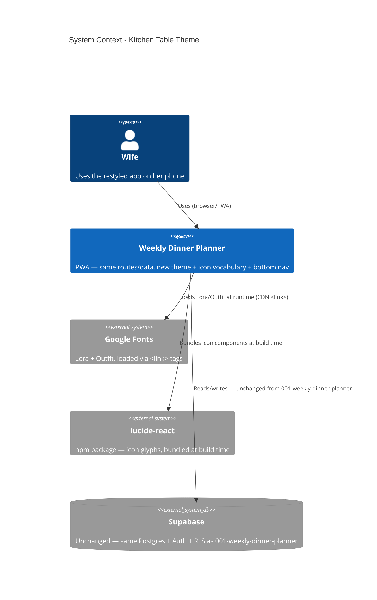

# Kitchen Table Theme - System Context

## System Overview

A presentation-layer restyle of the existing Dinner Ideas PWA: a Chakra UI theme, an icon vocabulary, and 3 structural navigation changes, applied across every screen. No new runtime system boundary — the app still talks only to Supabase; this intent adds two new _client-side_ dependencies (a component library and a font CDN), not a new integration.

## Context Diagram

## External Integrations

- **Google Fonts**: Lora + Outfit, loaded via `<link>` tags in `index.html` — a runtime CDN dependency (not bundled), same pattern as any web font.
- **`lucide-react`**: A new npm dependency, bundled at build time — not a runtime integration, no network calls.
- **Supabase**: Unchanged from `001-weekly-dinner-planner` — no new tables, RLS policies, or RPCs. This intent reads/writes nothing new.

## High-Level Constraints

- No backend/schema changes — every FR in this intent is presentation-only except the 3 structural navigation changes (FR-3/4/5), which are still client-only (routing/layout, no new Supabase surface).
- Must work well as an installed PWA on a phone (unchanged from `001-weekly-dinner-planner`'s constraint) — if anything, this intent is _the_ PWA-ergonomics pass (bottom tab bar, 44px tap targets).
- Chakra UI v2 only, no Tailwind (per `ux-guide.md`).

## Key NFR Goals

- No performance regression from font loading beyond the `<link>` tags' own cost.
- Every interactive control ≥ 44×44px; visible focus ring on every control.
- Light mode only — no dark-mode scope in this intent.
