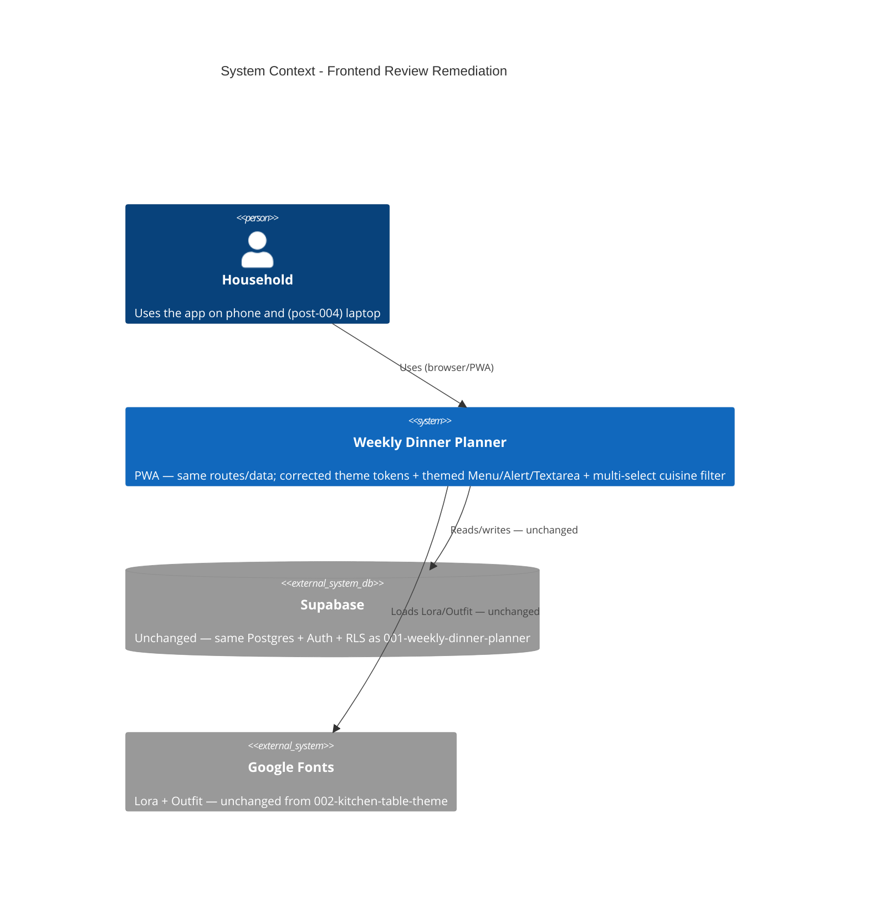

# Frontend Review Remediation - System Context

## System Overview

Presentation-layer remediation of the shipped Dinner Ideas PWA. No new runtime boundary — the app
still talks only to Supabase, over the same tables, RLS, and RPCs as `001-weekly-dinner-planner`.
This intent changes theme tokens, component theme entries, and a handful of component call sites; it
adds no dependency, no network surface, and no schema. The one behavioural change (FR-5, cuisine
multi-select) is client-side filter logic over already-fetched data.

## Context Diagram

## Actors

- **Household member** (Human): the only user. Interacts through the PWA on a phone today; a laptop
  becomes a first-class target in intent `004`. This intent's accessibility fixes (FR-1 contrast,
  FR-9 focus ring) matter for both.

## External Integrations

- **Supabase**: Unchanged. No new tables, policies, RPCs, or queries. FR-5 filters data already
  returned by the existing catalog query.
- **Google Fonts / `lucide-react`**: Unchanged from `002-kitchen-table-theme`. FR-8 uses
  `uiIcons.x`, already exported from `src/shared/components/icons.tsx`.

## Data Flows

### Inbound

None new. Same catalog / plan / shopping-list reads as today.

### Outbound

None new.

## High-Level Constraints

- Presentation-layer only. The single data-model touch is `CatalogFilterState.cuisine`
  (`string | null` → `string[]`) plus OR semantics in `filters.ts` — both client-side, in-memory,
  not persisted.
- No desktop structure (rail, measure caps, responsive screen reshapes, app-name treatment,
  pointer/hover states) — that is intent `004-desktop-layout`, which depends on this one. The lone
  md-breakpoint change here is FR-2's shopping-list control relocation, contained to one file.
- `theme-patch.ts` values are applied verbatim; the file is diffed section-by-section against the
  current `src/shared/theme/index.ts` first.
- Chakra UI v2 only; light mode only. Exactly one new token: `line.brandSubtle`.

## Key NFR Goals

- Corrected `ink` tokens meet WCAG AA against `paper.base` (informal spot-check, per `ux-guide.md` —
  no formal audit).
- The olive focus ring is visible on every interactive control, not just `Button`.
- Existing test suite stays green; assertions change only where markup or the filter data model
  changed (FR-2, FR-5, FR-8).
