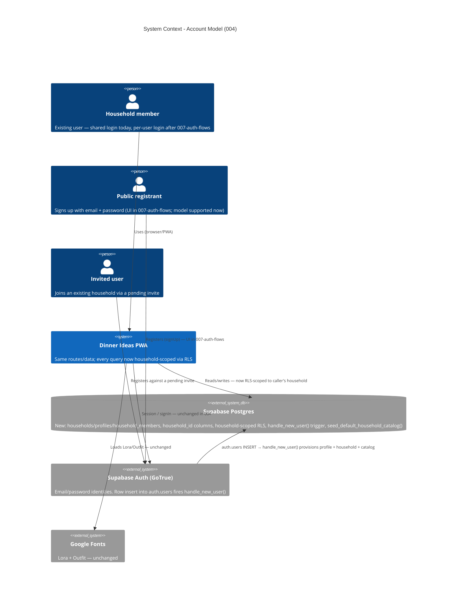

# Account Model - System Context

## System Overview

A data-model and authorization change to the Dinner Ideas PWA. No new runtime boundary and no new
external service: the app still talks only to Supabase (Postgres + Auth). What changes is _inside_
that boundary — a three-tier model (`auth.users` → `profiles` → `households`), a `household_id` on
every domain table, a full RLS rewrite to household-scoped policies, a `handle_new_user()` trigger
on `auth.users` that provisions each new account, and a one-time migration folding existing data
into a single founding household.

No screens are added in this intent. The existing shared password login keeps working as an owner
member of the founding household. The public registration UI, invite-sending UI, and settings page
are later intents (`007-auth-flows`, `008-account-settings`).

## Context Diagram

## Actors

- **Household member** (Human): the current user. Today authenticates with the shared household
  password; after `007-auth-flows` with a personal email/password. In `004` they operate as the `owner` of
  the founding household. Every read/write they make is transparently scoped to that household.
- **Public registrant** (Human): anyone who signs up. Registration creates a fresh `profiles`
  row, a new `households` row they own, and a full seeded catalog + store config. The sign-up
  _form_ ships in `007-auth-flows`; `004` makes the underlying provisioning work for any `auth.users` insert.
- **Invited user** (Human): a person with a pending `household_invites` row for their email. Their
  registration attaches them to the inviting household as a `member` instead of creating a new
  one. Invite _creation_ UI + email ship in `007-auth-flows`.
- **`handle_new_user()` trigger** (System): runs inside the `auth.users` INSERT transaction and
  performs all provisioning. It is the reason registration needs no server code.

## External Integrations

- **Supabase Postgres**: The change surface. New tables (`households`, `profiles`,
  `household_members`, `household_invites`), a `household_id` column + index on every domain
  table, reworked unique/PK constraints (`tags`, `grocery_store_rows`,
  `category_row_assignments`), 35 rewritten RLS policies, updated `fn_weekly_plans_record_meal_history`
  / `reorder_grocery_store_row` / `dinner_last_chosen`, and two new functions
  (`current_user_household_id()`, `seed_default_household_catalog()`).
- **Supabase Auth (GoTrue)**: Unchanged as an integration — same `signInWithPassword` /
  `getSession` / `onAuthStateChange` calls in `useAuth`. New: an `after insert on auth.users`
  trigger. No GoTrue config changes in `004` (email confirmation settings are a `007-auth-flows` concern).
- **Google Fonts / `lucide-react`**: Unchanged.

## Data Flows

### Inbound

- **`auth.users` INSERT** (from GoTrue, on any signup or a dashboard-created user) → fires
  `handle_new_user()` → writes `profiles`, `household_members`, and either a new `households` +
  seeded catalog or an invite-accept.
- **Migration input** (one-time): the existing global rows in every domain table, plus the
  designated founding-user identity (`garrett.peter.conn@gmail.com`).

### Outbound

None new. The app makes the same Supabase reads/writes as today; they are now filtered by
household-scoped RLS rather than returning every authenticated row.

## High-Level Constraints

- Supabase-only — no server tier. All authorization is RLS; all provisioning is a DB trigger.
- `supabase/migrations/` is append-only. The two shipped seed migrations are not edited; their
  data is re-expressed in `seed_default_household_catalog()` via a new migration.
- One household per user in this intent, enforced by `household_members.unique (profile_id)`.
  Multi-household is explicitly a later intent.
- No user-facing feature or screen changes. Catalog, plan, shopping list, cooking, and store
  config behave identically for the founding household.
- `standards/system-architecture.md` and `standards/tech-stack.md` currently assert the
  single-shared-login model and are updated within this intent.

## Key NFR Goals

- Zero cross-household read/write — verified per table in `supabase/tests/database/`.
- Zero migration data loss — every domain row ends with a non-null `household_id`.
- `handle_new_user()` is atomic within the `auth.users` insert transaction — no half-provisioned
  accounts.
- Existing frontend + DB test suites stay green on the new schema.
