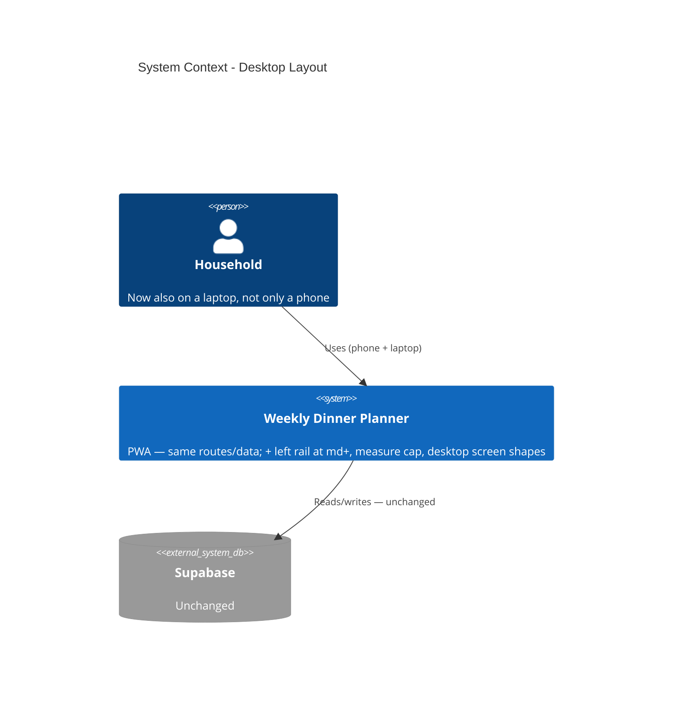

# Desktop Layout - System Context

## System Overview

A net-new responsive layer over the existing Dinner Ideas PWA. No runtime-boundary change — same
Supabase, same routes, same data. This intent adds a desktop nav shell (left rail), a content
measure cap, `md+` shapes for three screens, and pointer-hover states; it adds test infrastructure
(`matchMedia` polyfill + `ChakraProvider` render helper) so responsive components can be tested.

## Context Diagram

## Actors

- **Household member** (Human): the only user. This intent makes the laptop a first-class target
  alongside the phone/PWA.

## External Integrations

- **Supabase**: unchanged — no tables, RLS, RPCs, or queries touched.
- **`lucide-react` / Google Fonts**: unchanged from `002` / `003`. The rail uses existing
  `navItems` icons plus `uiIcons.storeConfig` / `uiIcons.logOut`.

## Data Flows

None new.

## High-Level Constraints

- Presentation-layer only; `md` (768px) is the single desktop breakpoint (Catalog's 3rd column at
  `xl` is the lone exception).
- Below md, every screen is exactly as it is after intent `003`.
- No new colours or type sizes; `Layout.reference.tsx` + README part two are the spec.
- `App.tsx` is not restructured.

## Key NFR Goals

- `ux-guide.md`'s low desktop bar: the phone app seated well on a large screen, not a desktop app.
- Full existing test suite green; `Layout.test.tsx` rewritten for the rail/tab-bar split.
- Responsive components become testable (new `matchMedia` polyfill + `ChakraProvider` wrapper).
