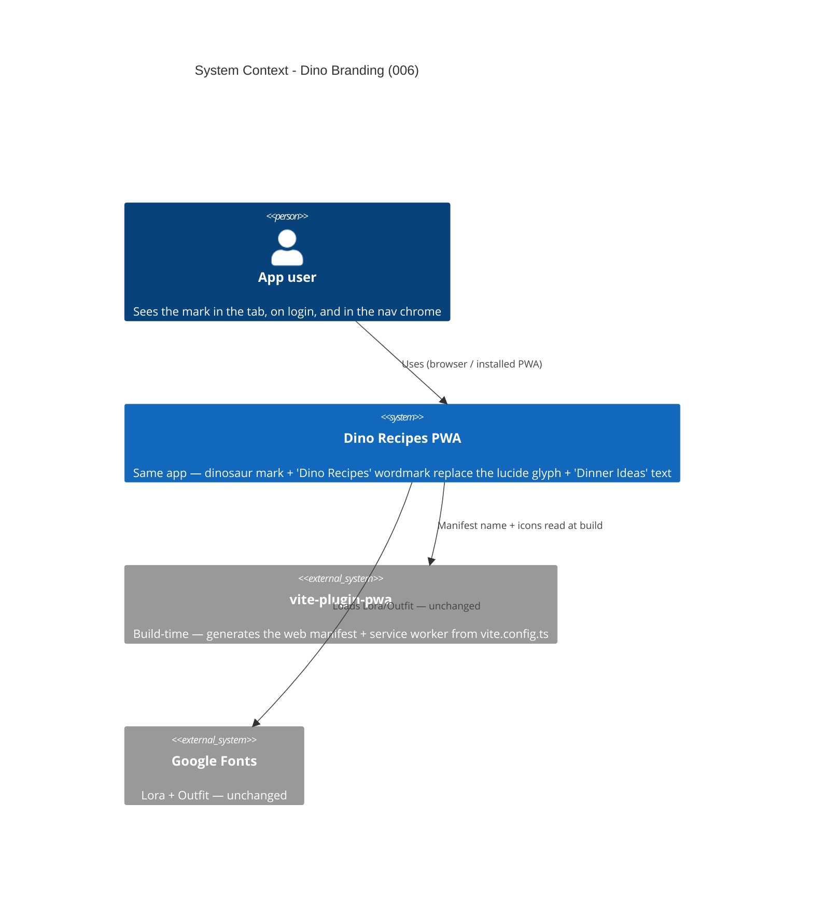

# Dino Branding - System Context

## System Overview

A cosmetic pass over the Dinner Ideas PWA. No runtime boundary changes: same routes, same
Supabase calls, same state. The intent swaps a lucide-glyph mark and a text wordmark for the
supplied dinosaur logo, renames the visible product to "Dino Recipes" on five surfaces, and
repoints the favicon / PWA icons at the new asset.

## Context Diagram

## Actors

- **App user** (Human): the only actor. Encounters the mark in the browser tab / installed
  icon, on the login screen, and in the desktop rail + mobile header while using the app. No
  behaviour changes for them.

## External Integrations

- **`vite-plugin-pwa`**: build-time only. This intent edits the `manifest.name`,
  `manifest.short_name`, and `manifest.icons` it is given in `vite.config.ts`. No plugin config
  or workbox change.
- **Google Fonts / `lucide-react`**: unchanged. (`uiIcons.logo` stays exported; it simply
  stops being used on the login screen.)

## Data Flows

### Inbound

None. No new data enters the system.

### Outbound

None new. The only new bytes served are the trimmed mark assets in `public/` / the bundle.

## High-Level Constraints

- Presentation-layer only. Files touched: `src/shared/components/Layout.tsx`,
  `src/features/auth/LoginForm.tsx`, `index.html`, `vite.config.ts`, `public/` icon assets, and
  the corresponding test files.
- Asset preparation (crop, background removal, resize from `logo.png`) is a one-off; the
  committed PNGs are the artifact.
- No new dependencies; Chakra v2; light mode only.

## Key NFR Goals

- No visible "Dinner Ideas" on the five renamed surfaces; no lucide `uiIcons.logo` on login.
- In-app mark asset ≤ ~15 KB; full `logo.png` never shipped to the client.
- `vite build`, `tsc -b`, `eslint`, and the existing test suite stay green.
