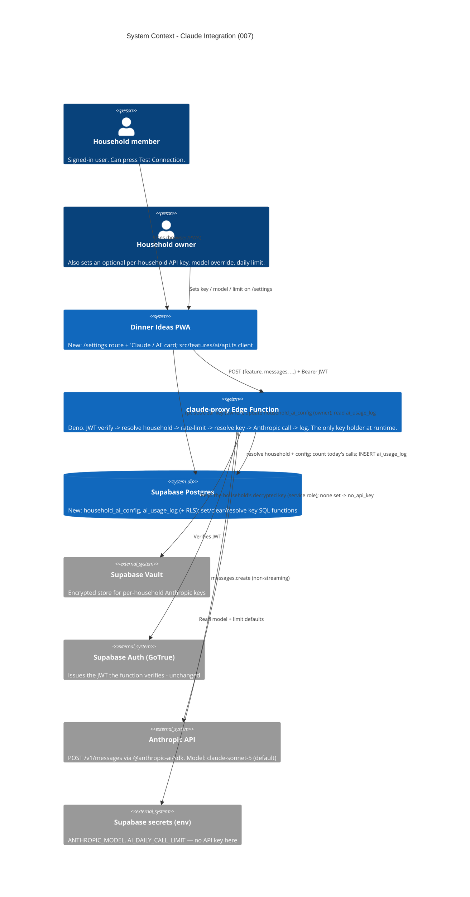

# Claude Integration - System Context

## System Overview

Adds a **new backend surface** to the Dinner Ideas PWA: a Supabase **Edge Function**
(`claude-proxy`, Deno/TypeScript) that is the app's only path to the Anthropic (Claude) API.
The SPA cannot hold an API key, so every Claude call is proxied through this function, which
authenticates the caller with their Supabase JWT, resolves that household's **own** Anthropic
key from Vault (no key set → `no_api_key`; there is no shared/founding key), enforces a
per-household daily call cap, calls Claude with `@anthropic-ai/sdk` (default `claude-sonnet-5`,
non-streaming), meters the call in `ai_usage_log`, and returns a typed result.

Two new Postgres tables back it — `household_ai_config` (non-secret per-household settings) and
`ai_usage_log` (append-only per-call audit). Per-household API keys are stored in **Supabase
Vault**, never in a regular column. The only user-facing surface is a new `/settings` route
whose first card ("Claude / AI") has a **Test Connection** button plus owner-only key / model /
daily-limit controls. No AI product feature ships here — recipe import (intent 008) is the
first real consumer of `claude-proxy`.

## Context Diagram

## Actors

- **Household member** (Human): any signed-in user. Can open `/settings` and press **Test
  Connection**, which makes one real Claude round-trip through `claude-proxy` and shows OK +
  latency or a mapped error.
- **Household owner** (Human): additionally sees owner-only controls on the AI card — set /
  clear a per-household Anthropic key (write-only), choose a model override, set the daily call
  limit. A non-owner member never sees these and the server rejects such writes even if forced.
- **`claude-proxy` Edge Function** (System): the new runtime boundary. Holds the API key only
  in memory for the duration of a request. Every request is authenticated, rate-limited, and
  logged. It is the single place intent 008 and later AI features call.
- **Recipe-import feature — intent 008** (future System consumer): will add a new `feature`
  tag and prompt and call `callClaude(...)`; it must not need any change to `claude-proxy`'s
  auth / key / limit / logging code.

## External Integrations

- **Anthropic API** (new): `POST /v1/messages` via `@anthropic-ai/sdk` (imported in Deno with
  an `npm:` specifier). Non-streaming. Default model `claude-sonnet-5`; allowlist
  `claude-sonnet-5`, `claude-haiku-4-5`, `claude-opus-5`; `max_tokens` ceiling 4096. Errors
  (4xx/5xx/timeout) are caught and mapped to a typed `error_code`; they never surface as an
  unhandled 500.
- **Supabase Edge Functions** (new use): the `claude-proxy` function, deployed with
  `supabase functions deploy claude-proxy`. Runs with the service role for its DB writes;
  verifies the caller's JWT explicitly.
- **Supabase Vault** (new use): stores each household's optional Anthropic key. Only
  `key_secret_id` (a Vault reference) is kept in `household_ai_config`. `vault.decrypted_secrets`
  is readable by the service role only — never by `authenticated` / `anon`.
- **Supabase Postgres** (extended): two new tables + RLS; three `security definer` SQL
  functions (`set_household_ai_key`, `clear_household_ai_key`, `resolve_ai_key`). Reuses
  intent 004's `households` / `profiles` / `household_members` and `current_user_household_id()`.
- **Supabase Auth (GoTrue)** (unchanged): still just issues the session JWT; the function
  verifies it.
- **Netlify** (unchanged): still serves the static SPA. No Netlify function is added — the
  server surface is the Supabase Edge Function.

## Data Flows

### Inbound

- **`POST /functions/v1/claude-proxy`** from the SPA — `{ feature, system?, messages[], model?,
max_tokens? }` plus `Authorization: Bearer <session access token>`. `household_id` is **not**
  in the body; the function derives it from the verified JWT.
- **`rpc('set_household_ai_key', { key })` / `rpc('clear_household_ai_key')`** from an owner —
  the plaintext key travels over the existing TLS Supabase connection into a `security definer`
  function that writes it to Vault. It never lands in a table or a response.
- **`update household_ai_config`** from an owner — `model_override`, `daily_call_limit` (plain
  columns, owner-only RLS).

### Outbound

- **`claude-proxy` → Anthropic** — `messages.create` with the resolved key.
- **`claude-proxy` → Postgres** — one `INSERT` into `ai_usage_log` per attempt.
- Nothing else new. The SPA still makes the same Supabase reads/writes for catalog / plan /
  shopping list / cooking / store config.

## High-Level Constraints

- Each household's Anthropic key is **per-household only** (no shared/founding key). It must
  never reach the browser bundle or any client-readable surface; the Edge Function is the only
  runtime holder and Supabase Vault is the only store. A household with no key set gets
  `no_api_key`.
- `household_id` is always resolved server-side from the JWT — never trusted from the request
  body.
- `supabase/migrations/` is append-only — new tables / policies / functions arrive in new
  migrations.
- `@anthropic-ai/sdk` is a **Deno-only** dependency (via `npm:`); the frontend gains no
  Anthropic package.
- The Edge Function is a new backend surface — `standards/system-architecture.md` and
  `standards/tech-stack.md` currently describe Supabase-Postgres as the whole backend and are
  updated in this intent.
- No streaming in v1; non-streaming `messages.create` only.
- Depends on intent 004 (households / profiles / household_members, `current_user_household_id()`)
  being live — it is.

## Key NFR Goals

- **Key confidentiality**: no key in the bundle, a table column, a client-readable view, or any
  API response — verified by code + RLS review.
- **Every attempt metered**: `ai_usage_log` rows : call attempts = 1:1, including failures and
  rate-limited calls.
- **Bounded per-household spend**: a per-household daily call cap (default 25) bounds how much
  a household can run up on its own key through the app; changing the cap needs no deploy.
- **Graceful upstream failure**: every Anthropic 4xx/5xx/timeout maps to a typed `error_code`,
  is logged, and is shown to the user — never an unhandled 500.
- **Reusability**: intent 008 adds a caller + prompt only; the proxy's auth / key / limit /
  logging code is untouched.
