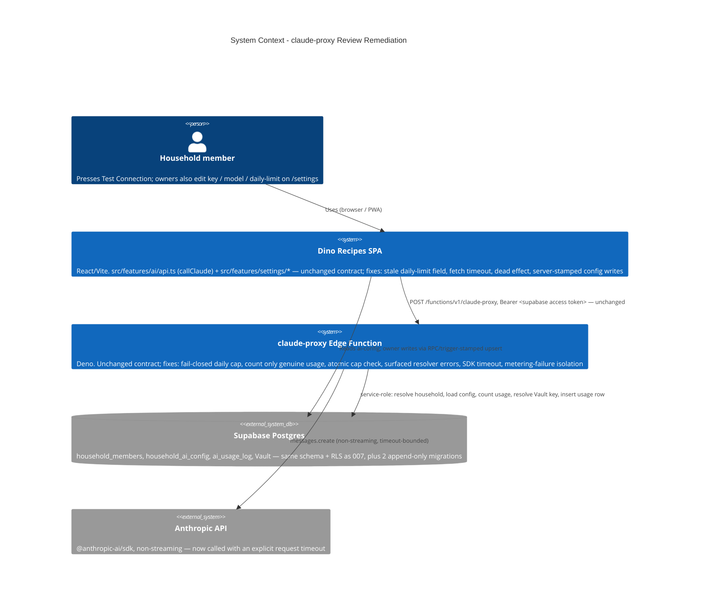

# claude-proxy Review Remediation - System Context

## System Overview

No new runtime boundary. This intent hardens code that intent `007-claude-integration`
already shipped: the `claude-proxy` Supabase Edge Function (the app's only path to the
Anthropic API) and the `/settings` "Claude / AI" card that drives it. The same actors, the
same two backend surfaces (Supabase Postgres + the Edge Function), the same external
dependency (Anthropic). It adds **no** new table, no new external integration, and no change
to the frozen `claude-proxy` request/response contract. It adds two small append-only
migrations (an atomic cap check; server-side `updated_by`/`updated_at` on
`household_ai_config`) and passes one new option (`timeout`) to the existing Anthropic SDK
client.

## Context Diagram

## Actors

- **Household member** (Human): the only user. Presses **Test Connection**; any member can.
  This intent fixes the button hanging forever when the function stalls (FR-5).
- **Household owner** (Human): additionally edits the API key, model override, and daily call
  limit. This intent fixes the daily-limit field showing a stale value (FR-5) and makes those
  edits carry `updated_by` server-side (FR-6).
- **`claude-proxy` Edge Function** (System, service role): the actor whose logic is corrected
  — cap enforcement, usage counting, resolver error handling, SDK timeout, metering isolation
  (FR-1..FR-4).
- **A greedy or buggy caller** (threat actor): a household's own compromised/looping client.
  The daily cap is the ceiling on what it can spend; FR-1/FR-2 close the ways that ceiling is
  currently evadable (transient error, bad env var, invalid-request flooding, concurrency).

## External Integrations

- **Supabase Postgres**: unchanged schema and RLS from `007`. Two new append-only migrations:
  (1) an atomic "insert usage row iff genuine-usage count `< daily_call_limit`" operation for
  FR-2 (RPC or a guarded `INSERT … SELECT … WHERE` — OQ-4); (2) a `BEFORE INSERT OR UPDATE`
  trigger stamping `household_ai_config.updated_by = auth.uid()` and `updated_at = now()` for
  FR-6 (OQ-2).
- **Anthropic API**: unchanged. FR-4 passes an explicit `timeout` (≈⅓ of the Edge Function
  platform wall-clock limit) to `new Anthropic(...)` and sets `maxRetries: 0` (OQ-3). No SDK
  version change.
- **No new integration.** No new npm/Deno dependency.

## Data Flows

### Inbound

None new. Same `POST` body and `Authorization: Bearer` as `007`.

### Outbound

None new. Same non-streaming `messages.create`; only bounded by a timeout now.

### Internal (corrected)

- **Cap check**: was `countToday()` (error-swallowing, all-rows) → read → _later_ insert.
  Becomes: an error-propagating count over _genuine-usage_ rows only, folded into an **atomic**
  under-limit insert so concurrent requests cannot all pass.
- **Resolver reads** (`resolveHousehold` / `loadConfig` / `resolveKey`): was `{ data }`-only,
  error ⇒ `null` ⇒ misleading `no_household` / `no_api_key`. Becomes: error ⇒ typed transient
  5xx; `null` ⇒ the genuine-absence response, as today.
- **Metering write on success**: was inside the `catch`-to-`upstream_error` try. Becomes:
  isolated, so a failed `ai_usage_log` insert after a paid call still returns `200`.

## High-Level Constraints

- Contract-frozen: status codes and the `error_code` enum from the `index.ts` header do not
  change — the fail-closed paths reuse `upstream_error` (OQ-1, resolved).
- `supabase/migrations/` append-only.
- The `200` happy-path body is byte-for-byte unchanged.
- `pipeline.ts` stays I/O-free; all new behaviour is reachable through injected `Deps` and
  covered by stubbed-`Deps` tests, matching `007`'s test style.
- `@anthropic-ai/sdk` pinned; `household_id` still server-resolved from the JWT.

## Key NFR Goals

- The daily cap cannot be silently disabled — not by a transient DB error, a non-numeric
  `AI_DAILY_CALL_LIMIT`, invalid-request flooding, or concurrent requests.
- Exactly one `ai_usage_log` row per resolved-household request holds on the success, timeout,
  metering-failure, and fail-closed paths.
- A successful, billed Anthropic call is never reported to the client as an error.
- The `timeout` outcome is actually reachable, and logged, before the platform kills the
  function.
- All of `007`'s acceptance criteria still pass; the happy path is unchanged.
