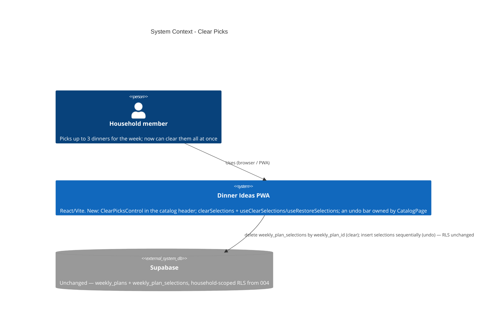

# Clear Picks — System Context

## System Overview

Presentation-layer + thin data-layer addition to the existing Dinner Ideas PWA. No new
runtime boundary: the app still talks only to Supabase, over the same `weekly_plans` /
`weekly_plan_selections` tables and RLS as `001-weekly-dinner-planner` / `004-account-model`.
This intent adds one component, one API function (`clearSelections`), two hooks
(`useClearSelections`, `useRestoreSelections`), and mounts + wires the control in
`CatalogPage`. No schema, no migration, no new dependency, no new asset, no theme change.

## Context Diagram

## Actors

- **Household member** (Human): the only user. Picks dinners in the catalog; this intent lets
  them wipe the week's picks in one guarded action and undo it until they move on.

## External Integrations

- **Supabase**: unchanged. `clearSelections` is one `DELETE … WHERE weekly_plan_id = $1` on
  `weekly_plan_selections`; Undo is N sequential `INSERT`s via the existing `addSelection`.
  Existing household-scoped RLS (`20260828232000`) governs both. No RPC, no policy change.
- **`lucide-react` / theme**: unchanged. `uiIcons.restore` (`RotateCcw`) and `uiIcons.info`
  (`Info`) are already exported from `src/shared/components/icons.tsx`; every colour / radius
  / type value is an existing token.

## Data Flows

### Inbound

None new. The control reads `selectedDinnerIds` (existing memo) for its `count`, and the
current plan id + selection order from the existing `useCurrentPlan()` query.

### Outbound

- **Clear**: `DELETE FROM weekly_plan_selections WHERE weekly_plan_id = <current plan id>`
  (one statement). The `weekly_plans` row is left intact.
- **Undo**: for each removed `dinner_id`, in order, `INSERT INTO weekly_plan_selections
(weekly_plan_id, dinner_id) …` via `addSelection` (sequential `await`).

Both invalidate `['weekly-plan','current']`.

## High-Level Constraints

- Option **1a** only (the header control). Option 1b is rejected.
- No schema / migration / dependency / token / theme-variant additions.
- Clear = one keyed `delete`, never N × `useToggleSelection` (stale-snapshot hazard).
- Undo = sequential re-adds in original order (not `Promise.all`).
- `PlanPage.tsx` is untouched.

## Key NFR Goals

- A mis-tap can't wipe the week: every clear passes an inline confirm and is undoable until
  the user picks again or navigates away.
- The control is theme-native: zero new tokens; no `danger` Button variant (the one
  terracotta fill is a call-site style).
- Keyboard-complete: confirm → focus "Keep"; cleared → focus "Undo"; `Escape` cancels; the
  undo bar is `aria-live="polite"`.
- Existing `weekly-plan` / `dinners` test suites stay green (additive assertions only).
