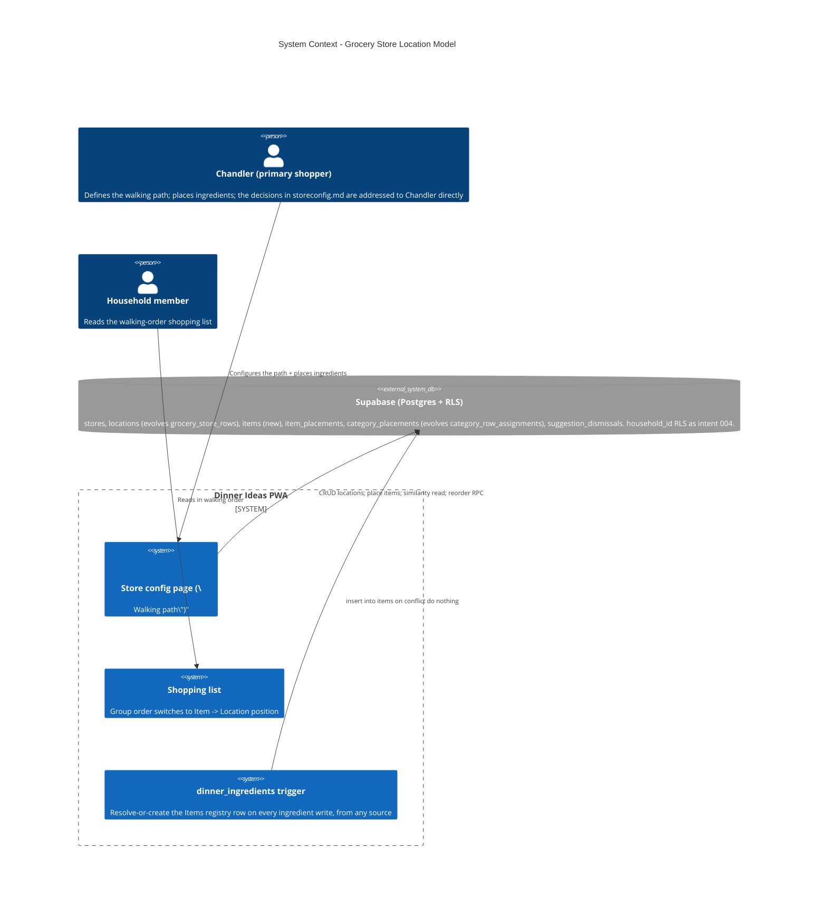

# Grocery Store Location Model — System Context

## System Overview

A brown-field data-model remodel of the grocery-store-config domain, the store-config page,
and the shopping-list sort that consumes it. No new runtime boundary — still Supabase-direct
(no backend server, no Edge Function). **Broad `category → grocery_store_row` mapping**
becomes **individual `Item (ingredient) → Location`**, with category-level placement kept as
an automatic fallback. A multi-store-ready schema lands now (`stores`); v1 UI shows exactly
one. New: a household-scoped Items registry (`items`) that doesn't exist in this app today,
kept in sync by a database trigger regardless of which code path creates an ingredient.

## Context Diagram

## Actors

- **Chandler** (Human, requester / primary shopper): defines the store as an ordered path of
  section + aisle stops and places individual ingredients at those stops. `storeconfig.md`'s
  product/UX decisions are addressed to Chandler and are treated as settled here.
- **Household member** (Human): reads the walking-order shopping list; does not necessarily
  configure the store.
- **Supabase Postgres + RLS**: the only backend. Enforces household isolation on every new
  table; hosts the reorder RPC and the Items-registry sync trigger.

## External Integrations

- **Supabase**: the whole change surface. New tables `stores`, `locations` (evolves
  `grocery_store_rows`), `items` (new registry), `item_placements`, `category_placements`
  (evolves `category_row_assignments`), `suggestion_dismissals`. A trigger on
  `dinner_ingredients` (insert/update) does the Items-registry get-or-create. RLS mirrors
  `20260828232000` on every new table. The reorder RPC generalizes
  `reorder_grocery_store_row` → `reorder_location`, scoped by `store_id`.
- **No new external dependency, no Edge Function, no new npm package.** The similarity match
  (FR-7) runs client-side in TypeScript, not `pg_trgm` or a SQL function.

## Data Flows

### Inbound

- Store-config page reads: the household's active Store's Locations (ordered by `position`);
  Items and their resolved placement (explicit / inherited / unassigned, FR-6); similarity
  candidates for an Item being placed (FR-7); the unassigned Items in scope (FR-13).
- The Items-registry trigger reads: `dinners.household_id` via the inserted/updated
  `dinner_ingredients` row's `dinner_id`.

### Outbound

- Add / rename / reorder / delete a Location (delete cascades to dependent placements —
  Resolved Decision #3).
- Place an Item at a Location: insert/replace its `item_placements` row (unique per
  `(item_id, store_id)`); accepting a similarity suggestion is the same single write.
- "Take it off the path": delete the Item's `item_placements` row.
- Dismiss a suggestion: insert a `suggestion_dismissals` row.

### Consumed downstream

- The shopping-list group-order function switches its sort key from
  `category → grocery_store_row.position` to each ingredient's resolved
  `Item → Location.position` (FR-6, FR-17); unlocated ingredients still sort after the path,
  alphabetically. `buildShoppingList` aggregation is unchanged.

## High-Level Constraints

- Supersedes `001` unit `004`'s model; reworks `src/features/store-config/` + the shopping
  sort. Tenancy is **not** re-solved — `grocery_store_rows` / `category_row_assignments` are
  already household-scoped.
- Append-only migrations. No edits to prior migration files.
- v1 reorder = up/down arrows (existing RPC pattern, generalized). No inline Item/category
  editing on this page in v1. Both addable later with **no schema change**.
- Similarity is suggestion-only; never auto-assigns.
- No separate design intent this time — `storeconfig.md`'s "Visual direction" section is the
  complete visual spec.

## Key NFR Goals

- Household isolation on every new table (RLS by `household_id`); cross-store safety enforced
  by composite FKs, not application code.
- Unassigned (`no item_placements row`) is a first-class valid state — no constraint or UI
  treats it as an error.
- `(store_id, position)` stays unique through every add / reorder / delete.
- Existing configured households get an equivalent walking path + shopping-list order after
  the cutover (no regression).
- The Items-registry sync is trigger-based so a future recipe-import feature (URL / Claude)
  needs no changes here when it ships.
- The model does not need a schema change to later add multi-store UI, drag-and-drop, or
  inline editing; the similarity engine is swappable behind its query interface.
