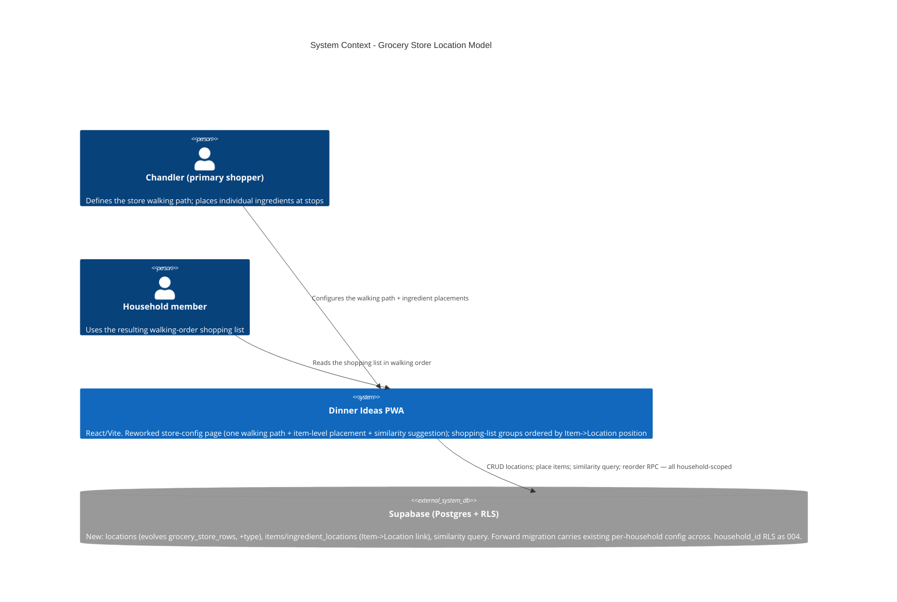

# Grocery Store Location Model — System Context

## System Overview

A brown-field data-model remodel of the grocery-store-config domain, plus the page and the
shopping-list sort that consume it. No new runtime boundary — still Supabase-direct (no
backend server, no Edge Function). The change: **broad `category → grocery_store_row`
mapping** becomes **individual `Item (ingredient) → Location`**, where a Location unifies
`section` and `aisle` stops in one ordered walking path. New household-scoped tables + one
forward migration; the `src/features/store-config/` feature and the shopping-list group-order
function are reworked; `dinner_ingredients` and every other feature are untouched.

Several boundaries are **provisional** pending OQ-C (Item registry vs. name-keyed mapping),
OQ-D (cutover mapping), OQ-A/OQ-B (deferred inline-edit / drag-and-drop).

## Context Diagram

## Actors

- **Chandler** (Human, requester / primary shopper): defines the store as an ordered path of
  section + aisle stops and places individual ingredients at those stops. The open questions
  are addressed to Chandler directly (the handoff forbids silent assumptions).
- **Household member** (Human): consumes the walking-order shopping list; does not
  necessarily configure the store.
- **Supabase Postgres + RLS**: the only backend. Enforces household isolation on every new
  table; hosts the race-safe reorder RPC and (for FR-4) a similarity query — possibly with
  `pg_trgm`.

## External Integrations

- **Supabase**: the change surface. New household-scoped tables (`locations`, and per OQ-C
  either an `items` registry or an `ingredient_locations` mapping); RLS policies mirroring
  `20260828232000`; the existing `reorder_grocery_store_row` RPC generalised to
  `reorder_location`; a similarity query (`ILIKE '%token%'` / `pg_trgm` `similarity()`), all
  scoped to the caller's household. One forward migration carries `grocery_store_rows` +
  `category_row_assignments` data across (OQ-D), then drops the old shape once safe.
- **No new external dependency, no Edge Function, no new npm package** (optionally enable the
  standard `pg_trgm` extension).

## Data Flows

### Inbound

- Store-config page reads: the household's Locations (ordered by `position`); the Items and
  their `location_id`; the unassigned Items (alphabetical); similarity matches for an Item
  being placed.

### Outbound

- Add / rename / reorder / delete a Location (reorder via the race-safe RPC).
- Place an Item at a Location (`update … set location_id = $1`); accept a similarity
  suggestion is the same single write.
- Deleting a Location nulls its Items' `location_id` (`on delete set null`).

### Consumed downstream

- The shopping-list group-order function switches its sort key from
  `category → grocery_store_row.position` to `ingredient → Item → Location.position`;
  unlocated ingredients still sort after the path, alphabetically. `buildShoppingList`
  aggregation is unchanged.

## High-Level Constraints

- Supersedes `001` unit `004`'s model + reworks `src/features/store-config/` + the shopping
  sort. `grocery_store_rows` / `category_row_assignments` are **already** household-scoped —
  tenancy is not re-solved.
- Append-only migrations. No edits to prior migration files.
- v1 reorder = existing up/down arrows (OQ-B). v1 has no inline Item / category editing on
  this page (OQ-A). Both must be addable later with **no schema change**.
- Similarity is suggestion-only; never auto-assigns.
- The **visual** redesign is a separate design intent — this intent is the functional / data
  contract.

## Key NFR Goals

- Household isolation on every new table (RLS by `household_id`).
- Unassigned (`location_id = null`) is a first-class valid state — no constraint or UI treats
  it as an error.
- `(household_id, position)` stays unique through every add / reorder / delete.
- Existing configured households get an equivalent walking path + shopping-list order after
  the cutover (no regression).
- The model does not need a schema change to later add inline editing (OQ-A) or drag-and-drop
  (OQ-B), and the similarity engine is swappable behind its query interface.
