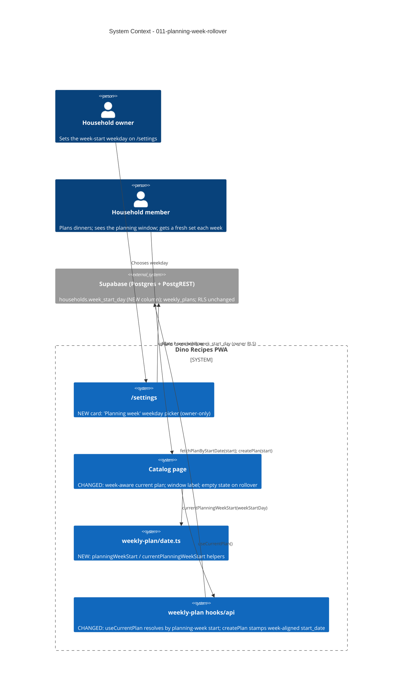

# Planning-Week Rollover — System Context

## System Overview

An enhancement to the existing React PWA + Supabase backend. It gives the app a live notion
of "the current planning week" derived from today's local date and a household-configurable
week-start weekday, makes the catalog picker week-aware (so it rolls over to an empty
selection set when the week advances), and shows the planning window on the catalog. The only
backend change is one additive column on `households`; everything else is client-side and
reuses existing queries and date helpers.

**Sequencing**: ships after `012-explicit-plan-locking` (locking must be a clear standalone
action before rollover makes it the sole feeder of `meal_history`) and before
`009-clear-picks-reset` (which becomes the narrower mid-week reset).

## Context Diagram

## External Integrations

- **Supabase / PostgREST** — one additive column `households.week_start_day smallint not null
default 0 check (0..6)`. No new RLS policy: the existing `"Household updatable by an owner"`
  (UPDATE) and `"Household readable by its members"` (SELECT) policies already cover it.
  `database.types.ts` regenerated.
- No new external services, no Edge Function, no new dependency.

## High-Level Constraints

- Local device time only; no stored timezone (single-family scope).
- Recompute the current planning week **on app open** — no live midnight flip, no timers.
- Reuse `formatWeekRange()` verbatim for the window label; reuse `fetchPlanByStartDate`.
- No change to the locking mechanism (that is `012`).
- Whole-date local math — DST-safe; no hour arithmetic.

## Key NFR Goals

- Correctness at the boundary: a pick at local 23:59 on the last day belongs to the ending
  week; at 00:00 on the week-start weekday it belongs to the new week.
- `planningWeekStart` is pure and deterministic.
- No regression to `/plan` week navigation, `012` locking, shopping-list generation, cooking
  view, or `meal_history`-on-lock.
- The feature is fully functional at the Sunday default before anyone visits `/settings`.
