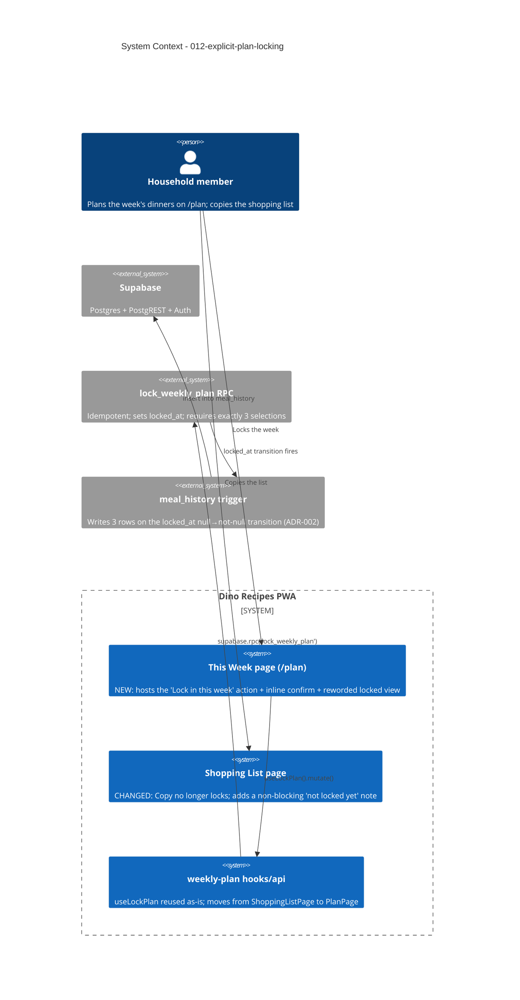

# Explicit Plan Locking — System Context

## System Overview

A client-only change to the existing React PWA. It moves the "lock this week's plan" action
out of the Shopping List Copy flow and makes it a deliberate control on `/plan` (This Week),
with an inline confirm. No new services, no schema change — the existing
`lock_weekly_plan` Supabase RPC and the `weekly_plans.locked_at` transition (with its
`meal_history` trigger) are reused untouched.

## Context Diagram

## External Integrations

- **Supabase `lock_weekly_plan` RPC** — reused verbatim. Idempotent; enforces exactly-3 via
  `trg_weekly_plans_require_three_on_lock`.
- **`meal_history` trigger** — unchanged; fires on the column transition regardless of the
  calling page. This is the whole reason the lock action must stay reachable and clear.

## High-Level Constraints

- No schema change, no migration, no new backend, no new dependency (one `uiIcons` glyph at
  most).
- The inline-confirm interaction must match intent `009`'s `ClearPicksControl` pattern.
- Locking stays one-way (no unlock) in v1.
- Ships **before** intent `011` so `meal_history` has a clear feeder when rollover lands.

## Key NFR Goals

- Zero behavioural change to locking semantics (still exactly-3, still idempotent, still
  one-way) — only the _entry point_ and _copy_ change.
- Shopping-list Copy has no lock side effect and its layouts are untouched.
- Accessibility parity with `009`: focus to the safe option on open, `Escape` cancels.
