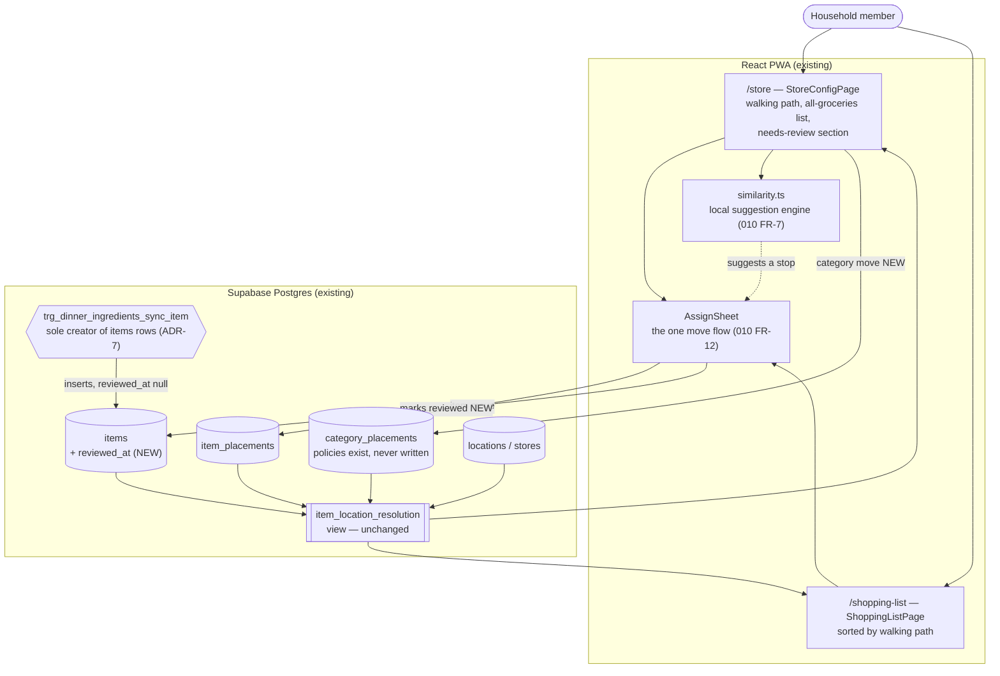

# Placement Edit Control — System Context

## System Overview

A change to the existing React PWA plus **one small additive migration**. It adds no service, no
external dependency and no API surface. Everything it needs at the data layer was created by
intent `010`'s migration A, with a single exception: `items` gains a `reviewed_at` column and a
write path for it.

The shape is deliberately the same as `010`'s: a data slice, a store-page slice, and a
shopping-list slice.

## Context Diagram

## What changes and what does not

| Component                                  | Change                                                                                                                                                                         |
| ------------------------------------------ | ------------------------------------------------------------------------------------------------------------------------------------------------------------------------------ |
| `item_location_resolution`                 | **None.** It already resolves placed → inherited → unassigned correctly. It may need to expose `reviewed_at` for convenience, which is a projection change, not a logic change |
| `item_placements`                          | **None.** Already written by `010`'s `placeItem` / `unplaceItem`                                                                                                               |
| `category_placements`                      | **No schema or policy change.** Full CRUD policies exist from `010` and are exercised by a write for the first time                                                            |
| `items`                                    | **One nullable column** `reviewed_at`, a backfill, and a narrowly-scoped write path                                                                                            |
| `trg_dinner_ingredients_sync_item`         | **None.** New rows arrive with `reviewed_at` null by default, which is exactly the desired behaviour — no trigger edit needed                                                  |
| `AssignSheet`, `similarity.ts`, dismissals | **Reused unchanged in behaviour**; gain new callers and one new action (mark reviewed)                                                                                         |
| `UnassignedSection`                        | Re-scoped from `unassigned` items to unreviewed items; its in-recipe narrowing is dropped                                                                                      |
| `LocationRow`                              | Four-item cap removed; category entry added                                                                                                                                    |
| `ShoppingListPage`                         | Gains a per-item move affordance                                                                                                                                               |

## Boundaries

**In scope**

- Item-level and category-level placement writes from the UI
- An all-groceries searchable list on `/store`
- A "New — needs review" queue driven by `items.reviewed_at`
- Local similarity suggestions on that queue
- A move affordance on the shopping list
- Correcting `010`'s FR-6 and superseding its FR-13 in the record

**Out of scope**

- Recipe import and any Claude/API call — intent `014`
- Retirement of `grocery_store_rows` / `category_row_assignments` — still gated on `010`'s
  Checkpoint 4 per ADR-9
- User-defined categories; the five-value CHECK on `dinner_ingredients.category` is unchanged
- Registry orphan cleanup — open question, deferred
- Any change to how ingredients get their category in the first place

## Key Integration Points

| Integration                        | Direction    | Notes                                                                                                                                                              |
| ---------------------------------- | ------------ | ------------------------------------------------------------------------------------------------------------------------------------------------------------------ |
| `similarity.ts` → needs-review row | read         | Must respect existing `suggestion_dismissals` (`010` FR-8)                                                                                                         |
| Assign flow → `items.reviewed_at`  | write        | Every path that places or accepts a stop marks reviewed; must be idempotent                                                                                        |
| Category move → resolution view    | write → read | Moving a category must visibly move inheriting items while leaving explicit placements alone — the observable proof that `010` FR-6's resolution order still holds |
| Shopping list → assign flow        | reuse        | Same sheet, same writes; only the entry point is new                                                                                                               |

## Risks

| Risk                                                                | Impact                                                      | Mitigation                                                                                                                                |
| ------------------------------------------------------------------- | ----------------------------------------------------------- | ----------------------------------------------------------------------------------------------------------------------------------------- |
| The `reviewed_at` write path widens access to `items.name`          | Breaks ADR-7's trigger-owned invariant                      | FR-6 states the invariant and leaves the mechanism to technical design; a column-scoped grant or a `security definer` RPC both satisfy it |
| Renaming an ingredient mints a new Item and orphans the old         | The review queue fills with renames the user did not create | Open question raised for technical design; the trigger fires on `update of name`                                                          |
| The all-groceries list grows past comfortable rendering             | Sluggish `/store` on mobile                                 | NFR sets a smooth-to-~500 bar; 121 today                                                                                                  |
| A concurrent insert during the backfill is silently marked reviewed | A genuinely new item skips the queue                        | Backfill must be bounded to rows existing at migration time, not a blanket update                                                         |
