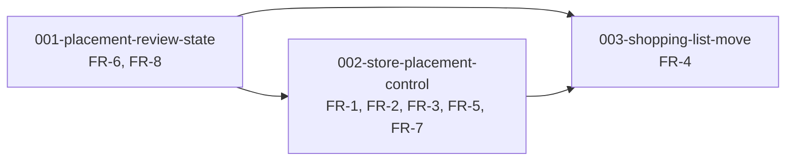

# Placement Edit Control — Unit Decomposition

## Units Overview

**Three units**, mirroring intent `010`'s own data / store-page / shopping-list split. That
shape is not copied for its own sake: this intent touches exactly the same three seams, and
keeping the correspondence makes the two intents legible side by side.

The data unit goes first because the review state is what the store-page unit's queue reads.
The shopping-list unit is last and independent — it can be cut without affecting the others,
matching FR-4's `Should` priority.

### Unit 1: `001-placement-review-state`

**Description**: The `items.reviewed_at` column, its backfill, a write path that preserves
ADR-7's trigger-owned invariant, and the corrections to `010`'s record.

**Requirements covered**: FR-6, FR-8, and FR-5's documentation half

**Why its own unit**: it is the only part of this intent that touches the database, and the
only part that carries deploy risk. Keeping it separate means it can be reviewed, tested with
pgTAP and shipped on its own terms — the same reason `010` split `001-location-item-model` out.

**Dependencies**: none

---

### Unit 2: `002-store-placement-control`

**Description**: The `/store` page — an all-groceries searchable list, category moves,
uncapped stop rows, the "New — needs review" queue, and local similarity suggestions on it.

**Requirements covered**: FR-1, FR-2, FR-3, FR-5, FR-7

**Why one unit**: every one of these is a change to `StoreConfigPage` and its components,
against the same resolution query, reusing the same `AssignSheet`. Splitting them would mean
splitting one page across units. It is the largest unit, and its bolt plan divides it in two.

**Dependencies**: requires `001` (the review queue reads `reviewed_at`)

**Note**: FR-2's category move needs **no** schema or policy work — `category_placements` has
carried full CRUD policies since `010` and has simply never been written to.

---

### Unit 3: `003-shopping-list-move`

**Description**: A move affordance on each shopping-list item, opening the same assign flow.

**Requirements covered**: FR-4

**Why separate**: a different page, a different team of components, and a `Should` priority.
It is the piece most likely to be cut or deferred, and isolating it makes that a clean decision
rather than an unpicking job.

**Dependencies**: requires `001` (a move marks reviewed) and `002` (reuses the move flow the
store page establishes)

---

## Dependency Graph

## Requirements Coverage

| FR   | Title                                                     | Unit                              |
| ---- | --------------------------------------------------------- | --------------------------------- |
| FR-1 | Every item is reachable by name                           | 002                               |
| FR-2 | Move a whole category to a stop                           | 002                               |
| FR-3 | Stops list what they actually hold                        | 002                               |
| FR-4 | Move from the shopping list                               | 003                               |
| FR-5 | "New — needs review" replaces the unassigned-only section | 002 (UI), 001 (record correction) |
| FR-6 | Review state                                              | 001                               |
| FR-7 | A suggested stop for unreviewed items                     | 002                               |
| FR-8 | Correct `010`'s FR-6 — `unassigned` is the orphan case    | 001                               |

Every FR is covered exactly once, except FR-5 which splits its UI from its documentation
deliberately — the supersede note belongs with the other record corrections in `001`.

## Sequencing

1. **`001`** — data and record. Ships alone; changes nothing a user sees.
2. **`002`** — the store page. The bulk of the value: everything becomes reachable.
3. **`003`** — the shopping list. Optional, cuttable, the closest match to the habit described.
