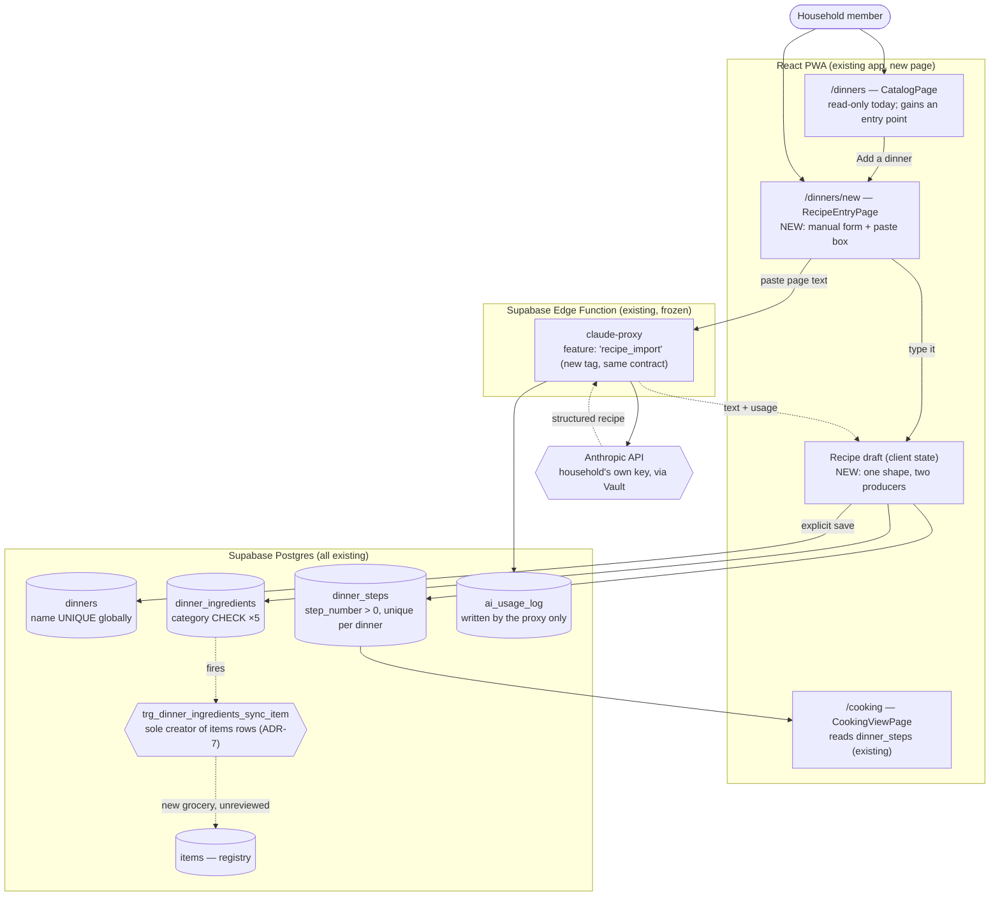

# Recipe Entry — System Context

## System Overview

A change to the existing React PWA, with **at most one additive migration**. No new Edge
Function, no new external dependency, no new RLS policy, no change to any existing table.

The possible migration is a single question, isolated below under "There is no transaction from
the browser": making a three-table save atomic may call for one Postgres function. That is the
owning unit's decision to make with an ADR, not something to assume here.

Otherwise: every table this intent writes
(`dinners`, `dinner_ingredients`, `dinner_steps`), the trigger that keeps the items registry in
step, the Edge Function that reaches Claude, and the insert policies that authorise the writes all
already exist and are all already used by shipped code. This intent is the **first writer** of the
dinner catalog from the application — until now the only writer was a seed migration.

The shape is three slices: a form that produces a draft, an extraction path that fills the same
draft from pasted text, and a save that writes three tables together.

## Context Diagram

## What This Intent Owns

| Thing                                     | Status | Note                                          |
| ----------------------------------------- | ------ | --------------------------------------------- |
| `/dinners/new` route and page             | NEW    | The only new surface                          |
| The recipe draft shape and its validation | NEW    | One client-side type both producers fill      |
| The extraction prompt and its parser      | NEW    | A new caller of the proxy, not a change to it |
| Paste sizing / trimming                   | NEW    | Client-side, against the frozen 50 KB cap     |
| The three-table save                      | NEW    | First application writer of the catalog       |
| An entry point on the catalog page        | CHANGE | One control added to `CatalogPage`            |

## What This Intent Must Not Touch

| Thing                                     | Why                                                                                  |
| ----------------------------------------- | ------------------------------------------------------------------------------------ |
| `claude-proxy` internals                  | Intent 007 froze the contract for this caller. Changing it means 007 under-delivered |
| `trg_dinner_ingredients_sync_item`        | ADR-7: the trigger is the _only_ creator of `items` rows                             |
| `item_placements` / `category_placements` | Placement is intent 010/013's surface, on `/store`                                   |
| `dinner_tags` / `tags`                    | Out of scope (open question 1)                                                       |
| Any RLS policy                            | The insert policies already exist and already fit                                    |
| The 50 seeded dinners                     | FR-9: create only, no edit                                                           |

## External Interfaces

| Interface                         | Direction      | Contract                                                                                                                     | Owner          |
| --------------------------------- | -------------- | ---------------------------------------------------------------------------------------------------------------------------- | -------------- |
| `POST /functions/v1/claude-proxy` | out            | `{feature, system?, messages, model?, max_tokens?}` → `{text, model, usage, latency_ms}` or `{error_code, message}`. Frozen. | Intent 007     |
| Supabase PostgREST inserts        | out            | `dinners`, `dinner_ingredients`, `dinner_steps` under existing RLS                                                           | Intent 001/004 |
| Anthropic API                     | out (indirect) | Reached only through the proxy, on the household's own key                                                                   | Intent 007     |

## Boundaries and Their Consequences

### The proxy returns text, not JSON

`claude-proxy` is typed as `{ text: string }`. It has no structured-output mode, no tool use, and
no schema enforcement. So the extraction contract is entirely this intent's problem: the prompt
asks for a specific shape, and **this side must parse and validate defensively**, treating a
malformed or partial response as a failed extraction rather than trying to salvage it.

This is the single largest source of risk in the intent, and it is why FR-7's review step is not
optional: the last line of defence against a bad parse is a human looking at the draft.

### `stop_reason: "refusal"` returns 200

Per the proxy README, a refusal is not an error — it comes back as a 200 with whatever text. A
paste that trips a refusal therefore looks like a successful call returning unparseable text. It
must land in the same "that didn't work, here's your text back" path as a parse failure, not as an
unhandled success.

### The registry sync is a side effect, not a call

Inserting `dinner_ingredients` causes `items` rows to appear. Nothing in this intent's code says
so, and nothing should. A new grocery arrives with `reviewed_at` null and surfaces in `/store`'s
review queue — the flow shipped in v0.11.0. That is the designed behaviour (ADR-7), and the only
thing this intent owes it is _not interfering_.

### `dinners.name` is globally unique

A pre-account-model artifact: the constraint is not scoped to household. With one founding
household it cannot bite in practice, but the UI must still report a clash in plain language
rather than surfacing a Postgres error. Open question 3 asks whether to fix the constraint; this
intent assumes not.

### There is no transaction from the browser

PostgREST inserts are separate HTTP calls. "Either all three tables or none" (FR-8) cannot be had
by wrapping them in a transaction from the client. The options are:

1. **One Postgres function** taking the whole recipe and doing three inserts in one transaction.
   Correct by construction, and in keeping with ADR-1's principle that anything which must hold
   regardless of caller belongs in Postgres. Costs one additive migration.
2. **Client-side compensation** — insert the dinner, then its children, and delete the dinner on
   failure (both child tables are `on delete cascade`, so one delete cleans up). No migration, but
   the compensating delete can itself fail, which is precisely the orphan FR-8 forbids.

ADR-1 points at option 1. This is a real design decision with a real trade, and it belongs to the
unit that owns the save — recorded as an ADR there, not assumed here.

## Data Flow: an import, end to end

1. User pastes page text into the entry page
2. Client checks it is non-empty; trims from the end if over the cap, and says so
3. Client POSTs to `claude-proxy` with `feature: 'recipe_import'` and the extraction prompt
4. Proxy authenticates, resolves household, reserves a call against the cap, resolves the Vault
   key, calls Anthropic, writes `ai_usage_log`, returns `{ text }`
5. Client parses the text into a draft; a malformed or step-less result is a failed extraction
6. Draft renders in the same editable form manual entry uses
7. User corrects anything, then explicitly saves
8. Save writes `dinners`, then `dinner_ingredients` and `dinner_steps`
9. The trigger registers any unseen grocery; it appears unreviewed on `/store`
10. The dinner is in the catalog, pickable for a week, and cookable in the cooking view

## Assumptions Carried Into Decomposition

- Manual entry and the save are useful **without** Claude, and must ship able to stand alone —
  a household with no API key gets a fully working entry page
- The extraction path is therefore a strictly additive layer over the manual path, which sets the
  unit boundary
- The draft shape is shared by both, so it belongs with the manual form, not with the extraction
