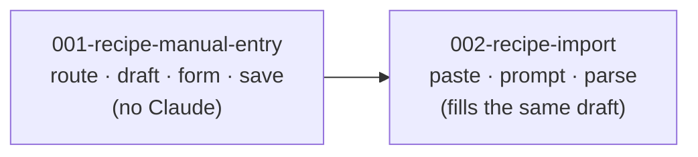

# Units: Recipe Entry

## Decomposition Principle

Two units, split along the line where value stops depending on Claude.

**Unit 001 delivers the whole feature for a household with no API key.** A dinner can be typed in
and saved. That is not a stub or a skeleton — it is the catalog's first write path, and it is
useful on its own the day it ships.

**Unit 002 is an accelerator over it.** It fills the same draft from pasted text instead of the
keyboard. It adds no field, no table and no save path, and it can be cut without invalidating a
line of unit 001.

The split was tempting in a third place — separating the form from the save — and that was
rejected: neither half delivers anything alone. "Add a dinner" needs both, so they ship together.

## Unit Summary

| Unit                      | Name                | Requirements      | Depends on | Cuttable |
| ------------------------- | ------------------- | ----------------- | ---------- | -------- |
| `001-recipe-manual-entry` | Recipe Manual Entry | FR-1, 2, 3, 8, 9  | none       | No       |
| `002-recipe-import`       | Recipe Import       | FR-4, 5, 6, 7, 10 | 001        | Yes      |

## Unit 001: Recipe Manual Entry

**Owns**: the `/dinners/new` route, the recipe draft shape and its validation, the manual form
(fields, ingredient lines, cooking steps, tags), the four-table save, and the entry point on
the catalog page.

**Delivers**: a household member can add a dinner. It appears in the catalog, is pickable for a
week, cooks correctly in the cooking view, and is reachable by tag filter.

**Key decision it must make**: how to keep the four-table save atomic (see system context, "There
is no transaction from the browser"). ADR-1 points at a Postgres function; client-side
compensation is the alternative. This unit records the choice as an ADR.

~~It carries a migration either way: resolved decision 3 scopes `dinners.name` uniqueness to the
household.~~ **Corrected 2026-09-08 (bolt 060):** intent 004 already did that on 2026-08-28, so
there was no certain migration. The unit ships one regardless — `fn_create_dinner` — chosen on the
atomicity argument alone (ADR-13).

**Why it is not cuttable**: it _is_ the intent. Everything else is a faster way to fill the form
it owns.

## Unit 002: Recipe Import

**Owns**: the paste box, oversize trimming, the extraction prompt, the response parser, mapping
every proxy error code to a plain message, and handing the parsed result to unit 001's draft.

**Delivers**: a recipe found online reaches the catalog without retyping, in the founding format,
with no cooking step lost.

**Consumes from unit 001**: the draft shape and the editable form. It produces a draft; it never
writes to the database itself. That boundary is what keeps FR-7's review step structurally
guaranteed rather than merely intended — the import path has no save of its own to accidentally
call.

**Why it is cuttable**: unit 001 ships a complete, useful entry page. If extraction quality turns
out to be poor enough that correcting a draft is slower than typing the recipe, the honest outcome
is to say so and cut it. The daily-cap cost is real and the manual path is already there.

**Its own cut criterion**: an imported draft must be _faster to correct than to type_. If review
routinely means rewriting most fields, the feature is costing an API call to save nothing.

## Dependency Graph

Strictly sequential. Unit 002 has nothing to fill until unit 001's draft exists.

## Requirements Coverage

| Requirement                            | Unit | Note                                         |
| -------------------------------------- | ---- | -------------------------------------------- |
| FR-1 A recipe entry page               | 001  | Both paths converge here                     |
| FR-2 Manual entry of a dinner          | 001  | Includes the steps editor                    |
| FR-3 Ingredient lines with a category  | 001  |                                              |
| FR-4 Import by pasting recipe text     | 002  |                                              |
| FR-5 Matches the founding format       | 002  | The prompt's job; the form allows correction |
| FR-6 Oversize paste trimmed            | 002  |                                              |
| FR-7 Review before saving              | 002  | Structural: import owns no save              |
| FR-8 Saving writes the existing shape  | 001  | The ADR and the name migration live here     |
| FR-9 Editing is out of scope           | both | A boundary, not a deliverable                |
| FR-10 Inferred tags stay in vocabulary | 002  | Editor is 001's; inference is 002's          |

Every Must-priority requirement is assigned. No requirement is split across units.

## Resolved Decisions

All three open questions were answered before decomposition, and their consequences are already
reflected above.

| #   | Decision                                                                 | Lands in                        |
| --- | ------------------------------------------------------------------------ | ------------------------------- |
| 1   | Tags are captured, and import infers them within the existing vocabulary | Editor in 001; inference in 002 |
| 2   | An abandoned import still burns a daily-cap call — accepted              | Documented in 002; no mechanism |
| 3   | `dinners.name` becomes unique per household                              | 001's save migration            |

Decision 3 removes the last doubt about unit 001's shape: it **will** carry a migration, so its
save bolt is a `ddd-construction-bolt` regardless of how the atomicity question is answered.

No open questions remain.
