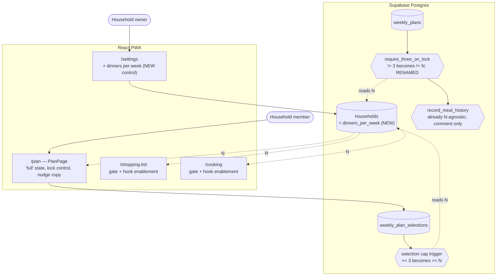

# Dinners Per Week — System Context

## System Overview

One additive migration plus the client sites that read the value. The unusual part is where the
work actually is: **most of it is in Postgres**, because the rule this intent parameterises was
never a client concern.

## Context Diagram

## The work, honestly sized

| Thing                         | Status  | Effort                                         |
| ----------------------------- | ------- | ---------------------------------------------- |
| `households.dinners_per_week` | NEW     | Small — `week_start_day` is a direct precedent |
| `/settings` control           | NEW     | Small — same precedent                         |
| Selection-cap trigger         | CHANGE  | **The real work** — has a concurrency history  |
| Lock trigger + rename         | CHANGE  | Moderate — a rename with an explicit drop      |
| `record_meal_history`         | COMMENT | Already correct; its comment lies              |
| 3 pgTAP files                 | CHANGE  | Moderate — assertions become setting-relative  |
| ~8 client sites               | CHANGE  | Small each, but spread across four features    |

## Why the trigger is the risky part

`20260827002830_weekly_planning_concurrency_fixes.sql` exists because two concurrent inserts could
each read a count below the cap and both commit, landing a plan at four selections. The fix takes a
`for update` lock on the plan row before counting.

Parameterising the bound must not disturb that. The count and the limit are now two reads instead
of one, and the household row is a second row that could be read — but the serialisation point is
the **plan** row, and it must stay the plan row. Reading `dinners_per_week` is a plain lookup that
does not need its own lock, since a setting change concurrent with a pick is not a correctness
problem: whichever value the transaction sees, the invariant "no more than N at commit" holds.

That reasoning should be written down in the migration, because the next person to touch it will
have the same question.

## What must not change

| Thing                          | Why                                                             |
| ------------------------------ | --------------------------------------------------------------- |
| The `for update` serialisation | It is the fix for a real bug; the cap's correctness rests on it |
| Enforcement living in Postgres | ADR-1 — the invariant must hold regardless of caller            |
| The default of 3               | Makes this deploy a no-op for the founding household            |
| `households`' RLS policies     | Member-SELECT and owner-UPDATE already cover a new column       |
