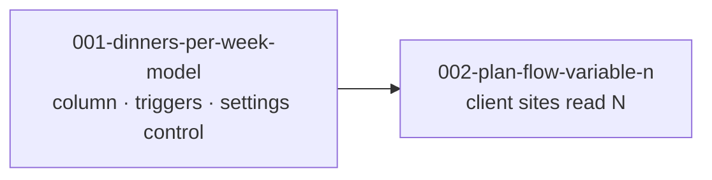

# Units: Dinners Per Week

## Decomposition Principle

Split where the risk is. The database rule and the client's reading of it are different kinds of
work with different failure modes, and the first is where this intent can actually go wrong.

## Unit Summary

| Unit                         | Name                   | Requirements     | Depends on | Cuttable |
| ---------------------------- | ---------------------- | ---------------- | ---------- | -------- |
| `001-dinners-per-week-model` | Dinners Per Week Model | FR-1, 2, 3, 4, 5 | none       | No       |
| `002-plan-flow-variable-n`   | Plan Flow Honours N    | FR-6             | 001        | No       |

Neither is cuttable. A setting nothing reads is useless; a client reading a setting that does not
exist is impossible. This intent is small enough that its two units are two halves of one change —
they are separated for sequencing and testing, not because either could ship alone.

## Unit 001: Dinners Per Week Model

**Owns**: the column, both trigger changes, the lock function's rename, the pgTAP updates, and the
`/settings` control.

**Why the settings control is here and not in 002**: it writes the value rather than reading it,
and it is the same one-control-on-`/settings` pattern `week_start_day` established in bolt 045.
Grouping it with the column keeps the write path in one place.

**The risk it carries**: the selection-cap trigger's concurrency guarantee. Parameterising a bound
that a previous bug report is attached to is the one way this intent can quietly break something.

## Unit 002: Plan Flow Honours N

**Owns**: every client site that currently hard-codes 3 — the plan page's full state, lock control
and nudge copy; the shopping-list and cooking-view gates; and the two hooks whose `enabled` is
`length === 3`.

**Why it is separate**: it is a mechanical sweep across four features with no design decisions in
it, and it cannot be started until the column exists. Keeping it apart stops a wide, shallow change
from obscuring the narrow, deep one in unit 001.

## Dependency Graph

## Requirements Coverage

| Requirement                            | Unit |
| -------------------------------------- | ---- |
| FR-1 `households.dinners_per_week`     | 001  |
| FR-2 Selection cap honours the setting | 001  |
| FR-3 Locking honours the setting       | 001  |
| FR-4 A setting control on `/settings`  | 001  |
| FR-5 Mid-week change behaviour         | 001  |
| FR-6 Every client site honours it      | 002  |

No open questions.
