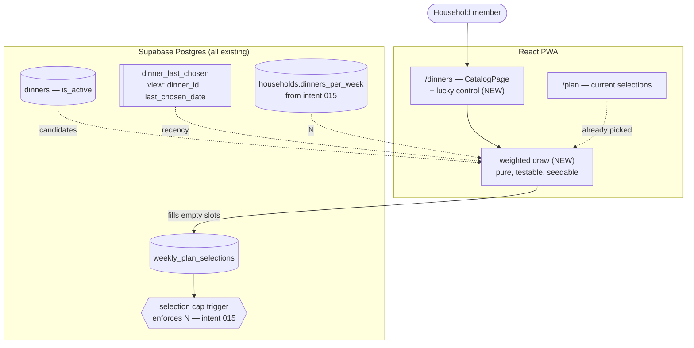

# I'm Feeling Lucky — System Context

## System Overview

Client-side only. No migration, no new table, no new query shape, no Edge Function. Everything it
reads is already loaded by the catalog, and everything it writes goes through the selection path
that hand-picking already uses.

## Context Diagram

## The one piece of real design

**The draw itself should be a pure function** — candidates plus recency in, chosen dinners out —
kept out of the component. That makes it testable with a seeded random source, which matters
because "is this actually random, and actually biased the right way?" is otherwise unfalsifiable.

A component that calls `Math.random()` inline cannot be tested for either property. Inject the
source.

## Why weighted rather than a cutoff

A hard "nothing eaten in the last N weeks" rule is easier to test but runs out of candidates on a
small catalog, and needs an N nobody has a principled value for. Weighting degrades gracefully: as
the eligible pool shrinks, recently-eaten dinners become reachable again instead of the feature
failing.

It must stay a **draw**, though. If pressing twice always gives the same answer, this is a sorted
list wearing a button's clothes — and the user asked for lucky.

## What it must not do

| Thing                  | Why                                                           |
| ---------------------- | ------------------------------------------------------------- |
| Overrule suppression   | `is_active = false` is a user decision (intent 001 FR-7)      |
| Replace existing picks | Intent 009's Clear Picks already owns destructive resetting   |
| Enforce the cap itself | Intent 015's trigger does; this feature must not duplicate it |
| Touch a locked plan    | Intent 012 owns locking; the triggers reject it anyway        |
