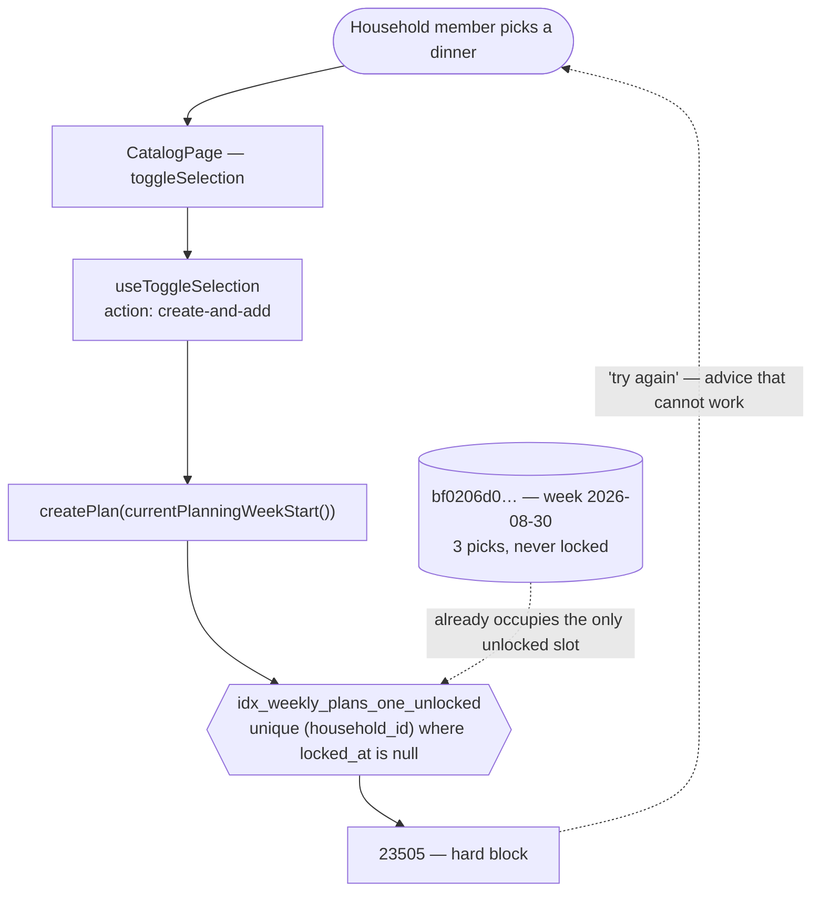

# Plan Rollover Remediation — System Context

## System Overview

One index definition, its tests, and one error message. No new table, no new column, no RLS
change, no Edge Function.

## The failure, end to end

## Why the index is the thing to change, not the code

Three options were considered:

1. **Widen the index to `(household_id, start_date)`** — the constraint was written before plans
   were week-keyed, and simply never revisited. Widening restores the protection bolt 027 actually
   wanted (no duplicate plans for a week) in the model the app now has.
2. **Auto-delete the stale draft on rollover** — destroys a user's picks to satisfy a constraint
   that is itself out of date. Fixing the symptom by deleting the evidence.
3. **Check for an existing draft in the client before creating** — moves an invariant out of
   Postgres, against ADR-1, and still races.

Option 1. The other two treat a stale definition as a fixed point.

## What the widening does and does not touch

| Thing                                     | Effect                                                         |
| ----------------------------------------- | -------------------------------------------------------------- |
| Existing rows                             | None can violate a widened constraint — no data remediation    |
| Concurrency protection (bolt 027)         | Preserved, scoped to the week                                  |
| `nulls not distinct`                      | Must be kept — intent 004's null-household window relies on it |
| RLS                                       | Untouched                                                      |
| `lock_weekly_plan` / meal-history trigger | Untouched                                                      |

## The one asymmetry worth stating

A widening migration cannot fail on production data, which is why this intent needs no rehearsal
and no staging — the opposite of intent 010's cutover, which needed both. The risk here is not the
migration; it is **the tests**, which currently assert the old rule and would go green against
either definition if updated carelessly.

That is why unit 001's bolt is DDD: the interesting work is deciding precisely what the invariant
should be and proving it, not writing the one-line DDL.
