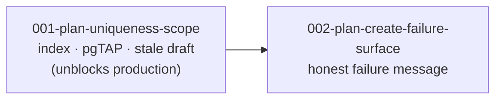

# Units: Plan Rollover Remediation

## Decomposition Principle

One unit fixes the bug; the other improves what the app says when a pick fails for any reason.
They are separated because only the first is urgent — production is blocked until it ships, and it
should not wait on a copy change.

## Unit Summary

| Unit                              | Name                        | Requirements | Depends on | Cuttable |
| --------------------------------- | --------------------------- | ------------ | ---------- | -------- |
| `001-plan-uniqueness-scope`       | Plan Uniqueness Scope       | FR-1, 2, 4   | none       | No       |
| `002-plan-create-failure-surface` | Plan Create Failure Surface | FR-3         | 001        | Yes      |

## Unit 001: Plan Uniqueness Scope

**Owns**: the index change, the pgTAP updates, and the operational decision about the stale
production draft.

**This is the fix.** Everything else in the intent is improvement around it.

**Why the stale-draft decision lives here rather than in Operations alone**: the migration and the
data question are the same problem seen from two sides, and separating them is how a fix ships
while the row that caused the incident sits unresolved. FR-1 unblocks picking without touching the
row; the row only decides whether that week's history survives.

## Unit 002: Plan Create Failure Surface

**Owns**: telling the user something true when a pick cannot be saved.

**Why it is separate and cuttable**: production is blocked right now, and a message improvement
must not delay the unblock. Once unit 001 ships, this particular failure becomes unreachable
anyway — which is precisely why it is a `Should`. It earns its place by covering the _next_
unforeseen constraint failure, not this one.

**The trap it must avoid**: distinguishing a permanent failure from a transient one by
string-matching Postgres's message text. That text is not a contract. Use the error's code or
identity.

## Dependency Graph

## Requirements Coverage

| Requirement                                | Unit |
| ------------------------------------------ | ---- |
| FR-1 Scope the uniqueness to the week      | 001  |
| FR-2 The tests assert the new rule         | 001  |
| FR-3 No "try again" on a permanent failure | 002  |
| FR-4 The stale production draft resolved   | 001  |

## Open Questions

Carried from requirements: whether the app should do anything on rollover about a previous week's
unfinished draft. Out of scope — this intent restores correctness rather than adding a flow.
