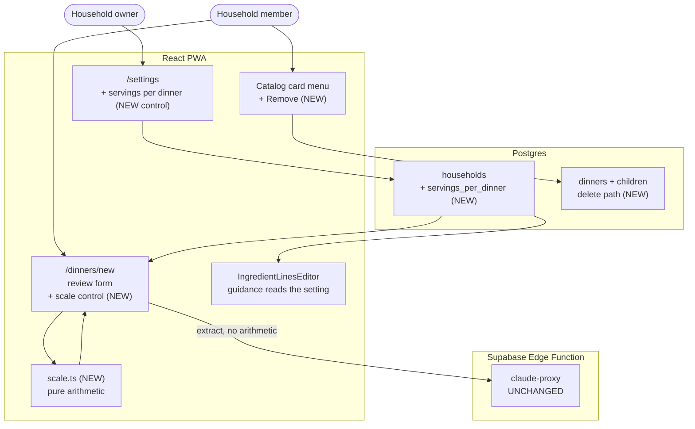

# Scaling and Removal — System Context

## System Overview

Three changes that share a cause but not a mechanism: a household value in Postgres, a piece of
arithmetic moving **out of a language model and into the client**, and a delete path that the
catalog has never had.

The unusual part is the second. Most intents add behaviour; this one **takes behaviour away from
the model** and gives it to code that can be tested.

## Context Diagram

## What changes, and what deliberately does not

| Component               | Change                                                                  |
| ----------------------- | ----------------------------------------------------------------------- |
| `households`            | One additive column, defaulted to 3 — existing households unaffected    |
| `/settings`             | One control, the `week_start_day` / `dinners_per_week` pattern again    |
| `prompt.ts`             | The rescaling instruction is **removed**; the serving count is reported |
| `parse.ts`              | Carries the source's stated serving count through to the draft          |
| Review form             | Gains a scale control that calls pure code                              |
| `IngredientLinesEditor` | Its "3 servings" guidance reads the setting                             |
| Catalog card menu       | Gains Remove, beside the existing "Not interested"                      |
| `claude-proxy`          | **Untouched.** Frozen since intent 008                                  |
| `fn_create_dinner`      | **Untouched.** Saving is not what changed                               |
| Existing catalog rows   | **Untouched.** NFR-1                                                    |

## The boundary that matters

Today the extraction both reads a page **and** does arithmetic on it. After this intent it only
reads.

That line — model reports, code computes — is the intent's real content. Everything else is a
column, a control and a delete. Drawn once and drawn clearly, it means a shopping-list quantity can
never again be wrong because a language model divided badly, and the user can see the source's own
numbers before anything touches them.

## Integration Points

- **`claude-proxy`** — same caller, same contract, a shorter prompt. Removing the rescaling rule
  makes the system prompt smaller, which slightly _increases_ the paste budget.
- **`households`** — read by the review form and the ingredients editor; written only by Settings.
- **`dinners` and its children** — the delete path is new; the write path is not touched.

## Risks

| Risk                                                                  | Where it lands |
| --------------------------------------------------------------------- | -------------- |
| Removing a dinner that a plan or meal history references              | Unit 003       |
| Scaling arithmetic on decimals producing unusable quantities (0.333…) | Unit 002       |
| A ranged serving count with no single correct reading                 | Unit 002       |
| The "3" literal surviving somewhere a grep misses                     | Unit 001       |
