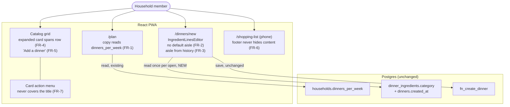

# UI Correctness Fixes — System Context

## System Overview

Entirely inside the React PWA. No table, function, policy or Edge Function changes (NFR-1). The
one new data flow is a **read**: the entry form fetches the household's ingredient-name → aisle
history from rows Postgres already holds, under RLS it already has.

## Actors

- **Household member** (human): plans the week on `/plan`, browses the catalog, types dinners into
  `/dinners/new`, shops from `/shopping-list` on a phone. Sees every change in this intent.

## External Systems

- **Supabase Postgres** (existing): read-only here. `dinner_ingredients` (name, category) joined to
  `dinners` (created_at) for FR-3. Both have household-scoped SELECT policies.
- **claude-proxy Edge Function**: unchanged. Imported drafts still arrive with an aisle per line,
  which FR-3 treats as chosen.

## Data Flows

### Inbound

- **Aisle history** (new): once per entry-form open (NFR-2), a list of `(name, category, dinner
created_at)` for the household, reduced client-side to one aisle per trimmed, lowercased name,
  taken from the most recently created dinner.

### Outbound

- **Saved dinner** (unchanged shape): `fn_create_dinner` still receives a category on every line.
  FR-2 guarantees there is one; a placeholder is never sent.

## Context Diagram

