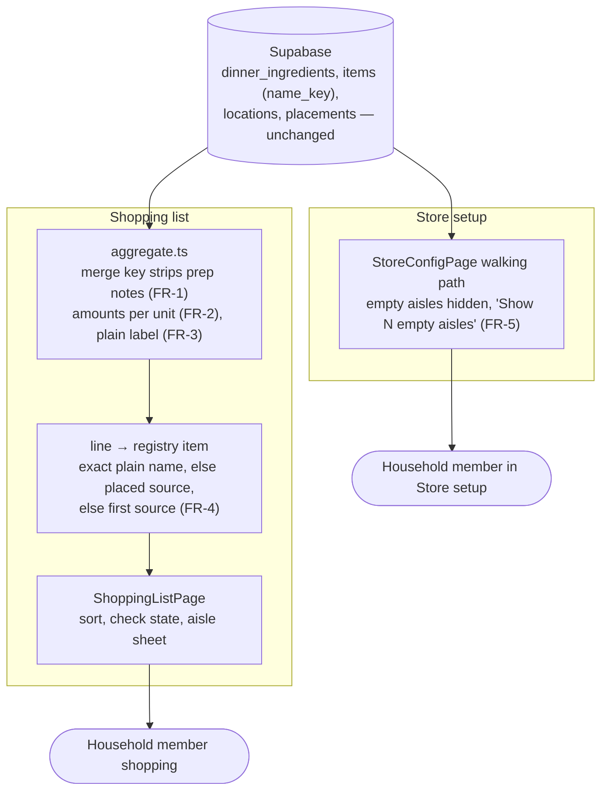

# Shopping List Consolidation — System Context

## System Overview

This all happens in the React PWA. The client already builds the shopping list from the week's
dinners (`buildShoppingList`), then sorts it by the household's walking path
(`reorderGroupsByLocation`). This intent changes three things in that build: how it decides two lines
are the same, what a line carries, and how a line finds its aisle. Store setup gets a filter on what
it displays. No table, policy, RPC or generated column changes (NFR-1).

## Actors

- **Household member shopping**: reads one line per grocery, checks lines off, and sometimes moves a
  line to a different aisle from the list.
- **Household member setting up the store**: walks the path in Store setup and shouldn't have to
  scroll past aisles they never use.

## External Systems

- **Supabase Postgres**: read as today. `items.name_key` (`lower(btrim(name))`) stays the registry's
  identity, so each raw ingredient name is still its own item. The merge only changes how the list
  displays those items, not the items themselves.
- **claude-proxy Edge Function**: unchanged.

## Data Flows

Nothing crosses the boundary that doesn't already. Inside the client:

1. The week's `dinner_ingredients` → **merge key** (prep notes stripped, FR-1) → one line per key,
   carrying one amount per unit (FR-2), a plain label (FR-3), and the raw names that went into it
2. Line + resolved registry items → **the line's registry item**, chosen by FR-4's rules → aisle
   position, and the item the "Where do you find it" sheet opens
3. Store setup: locations + items + category placements → **empty?** → hidden unless toggled (FR-5)

## Context Diagram

