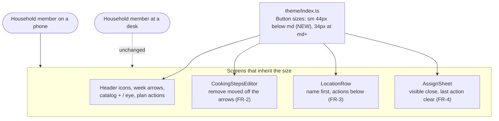

# Mobile Ergonomics — System Context

## System Overview

Entirely inside the React PWA, and mostly inside one file: the theme. No data crosses any boundary
that did not already, no query changes, and nothing new is stored (NFR-1). What changes is how big
things are below `md`, and how two rows and one sheet arrange what they already show.

## Actors

- **Household member on a phone** (human): cooks from the step editor, shops from the list, and
  sets up the walking path one-handed. Every change here is theirs.
- **Household member at a desk**: must see no difference (NFR-2).

## External Systems

- **Supabase Postgres**: unchanged. No query, policy or table is touched.
- **claude-proxy Edge Function**: unchanged.

## Data Flows

None new. The aisle sheet keeps the reads and writes it has today; this intent adds a close control
beside them.

## Context Diagram

